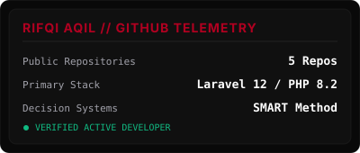
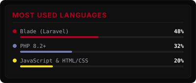

<div align="center">

  <!-- Header Banner SVG with Holographic Glow & Particles -->
  

  <br/><br/>

  <!-- Dynamic Typing Subtitle SVG -->
  <a href="https://git.io/typing-svg">
    
  </a>

  <br/>

  <!-- Core Status Badges -->
  <p align="center">
    <a href="https://github.com/RifqiAqil-ops">
      
    </a>
    <a href="https://github.com/RifqiAqil-ops">
      
    </a>
    <a href="https://github.com/RifqiAqil-ops">
      
    </a>
    <a href="https://github.com/RifqiAqil-ops">
      
    </a>
  </p>

</div>


<br/>

## ⚡ ABOUT ME

```typescript
const developer = {
  name: "Rifqi Aqil",
  role: "Laravel & PHP Developer",
  stack: ["Laravel 12", "PHP 8.2", "Blade", "MySQL", "Tailwind CSS"],
  focus: "Decision Support Systems & Web Applications"
};
```

> Software developer specializing in Laravel, PHP, and MySQL. I build practical web applications, multi-criteria decision support tools (SMART method), and inventory workflows.

<br/>


<br/>

## 🎯 CURRENT FOCUS

<table width="100%">
  <tr>
    <td width="50%" valign="top">
      <h3>🔍 Decision Support Systems</h3>
      <p>Building decision evaluation tools using the SMART method to calculate weighted criteria rankings.</p>
    </td>
    <td width="50%" valign="top">
      <h3>💻 Web Application Development</h3>
      <p>Developing maintainable web applications using Laravel 12, Blade components, and Tailwind CSS.</p>
    </td>
  </tr>
  <tr>
    <td width="50%" valign="top">
      <h3>🔌 API Automation & Tools</h3>
      <p>Integrating Google Docs API to automate template tag injection and report generation in PHP.</p>
    </td>
    <td width="50%" valign="top">
      <h3>🗄️ Database Modeling</h3>
      <p>Designing relational MySQL database schemas for tracking inventory, logs, and business operations.</p>
    </td>
  </tr>
</table>

<br/>


<br/>

## 🚀 FEATURED REPOSITORIES

<table width="100%">
  <tr>
    <td width="50%" valign="top">
      <h3><a href="https://github.com/RifqiAqil-ops/spk-smart-mouse-selection">🖱️ spk-smart-mouse-selection</a></h3>
      <p><b>Problem:</b> Evaluates wireless mice metrics to remove subjective buying decisions.<br/>
      <b>Tech:</b> Laravel 12, Blade, PHP 8.2, Tailwind CSS.<br/>
      <b>Highlights:</b> Uses the SMART method to score price, DPI, weight, battery, and ergonomics.</p>
      <p>
        
        
        
      </p>
    </td>
    <td width="50%" valign="top">
      <h3><a href="https://github.com/RifqiAqil-ops/global-supply">📦 global-supply</a></h3>
      <p><b>Problem:</b> Tracks inventory movements across multiple warehouse locations.<br/>
      <b>Tech:</b> Laravel, MySQL, Blade, JavaScript.<br/>
      <b>Highlights:</b> Manages stock levels, supplier records, and purchase manifests.</p>
      <p>
        
        
        
      </p>
    </td>
  </tr>
  <tr>
    <td width="50%" valign="top">
      <h3><a href="https://github.com/RifqiAqil-ops/gdocs">📄 gdocs</a></h3>
      <p><b>Problem:</b> Automates report document creation from template placeholders.<br/>
      <b>Tech:</b> PHP 8.2, Google Docs API, OAuth2.<br/>
      <b>Highlights:</b> Injects dynamic variables directly into Google Docs templates via API.</p>
      <p>
        
        
      </p>
    </td>
    <td width="50%" valign="top">
      <h3><a href="https://github.com/RifqiAqil-ops/Gaji">💼 Gaji</a></h3>
      <p><b>Problem:</b> Calculates employee salaries and tax tier deductions automatically.<br/>
      <b>Tech:</b> Laravel, Blade, PHP.<br/>
      <b>Highlights:</b> Generates monthly payroll breakdowns and compensation logs.</p>
      <p>
        
        
      </p>
    </td>
  </tr>
  <tr>
    <td colspan="2" width="100%" valign="top">
      <h3><a href="https://github.com/RifqiAqil-ops/hotel-crud">🏨 hotel-crud</a></h3>
      <p><b>Problem:</b> Manages hotel room availability and customer reservations.<br/>
      <b>Tech:</b> PHP, MySQL, HTML/CSS.<br/>
      <b>Highlights:</b> Room scheduling CRUD interface with booking records.</p>
      <p>
        
        
        
      </p>
    </td>
  </tr>
</table>

<br/>


<br/>

## 🛠️ TECH STACK

### ⚙️ Backend
<p>
  
  
  
  
</p>

### 🎨 Frontend
<p>
  
  
  
  
</p>

### 🗄️ Database
<p>
  
  
</p>

### 🛠️ Tools
<p>
  
  
</p>

<br/>


<br/>

## 📊 GITHUB STATS

<div align="center">

  <table border="0">
    <tr>
      <td>
        
      </td>
      <td>
        
      </td>
    </tr>
  </table>

</div>

<br/>


<br/>

## 🎮 PAC-MAN CONTRIBUTION GRAPH

<div align="center">
  
</div>

<br/>


<br/>

## ⏳ TIMELINE

```
2026 JULY    ──► Built SPK Wireless Mouse Selection System (Laravel 12 + SMART Method)
2026 JUNE    ──► Developed Global Supply Chain Management System
2026 JUNE    ──► Created GDocs Google Docs API Integration Tool
2026 MAY     ──► Built Gaji Payroll Calculation App
2026 APRIL   ──► Developed Hotel Reservation CRUD App
2023 MARCH   ──► Started active development on GitHub (@RifqiAqil-ops)
```

<br/>


<br/>

## 📬 CONTACT

<div align="center">

  <p>Feel free to reach out for collaborations, questions, or project inquiries.</p>

  <p>
    <a href="mailto:rifqiaqil822@gmail.com">
      
    </a>
    <a href="https://github.com/RifqiAqil-ops">
      
    </a>
  </p>

</div>

<br/>

<div align="center">
  <sub>Building practical software, one project at a time.</sub>
</div>
